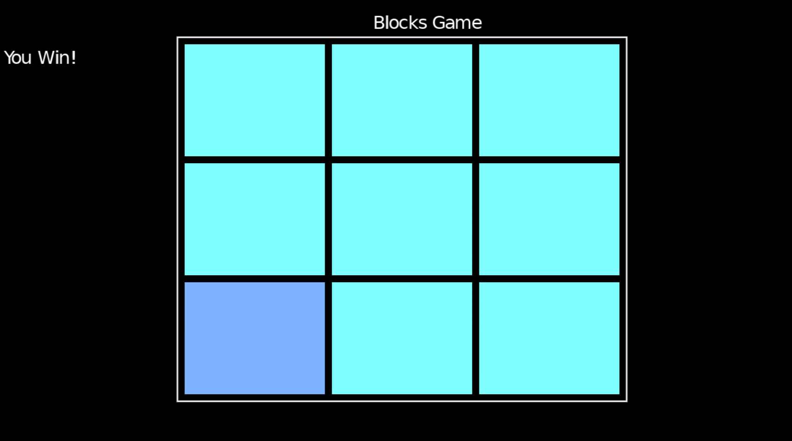
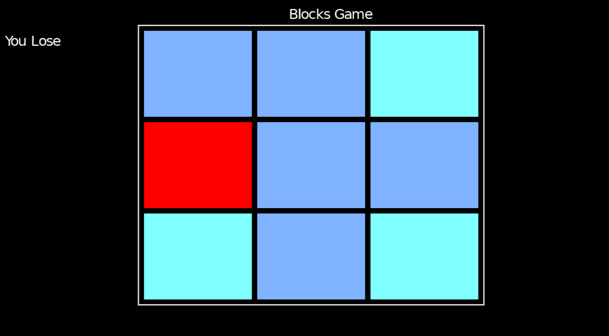

# block-game
A simple block game made in lua

A short time ago, I decided to venture into Lua, so for a while I thought about what project I would do with this language, so I decided to create this game.

Basically you have nine blocks, one of them has a bomb, the task is to click on the 8 that do not have the bomb, if you click on the bomb you lose.

The game is still a bit confusing and unreadable, I'm still learning the rules and how to use the language in the best way.

Ah, the project uses Love2d, a platform for creating games with Lua, so to run it you need to have the love2d loader.

***Screens***

Thanks for being here, and have a good day, or afternoon, or evening ;-;
